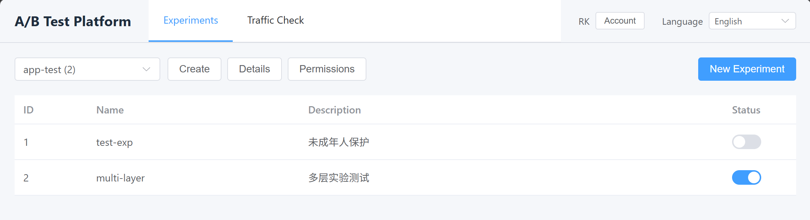
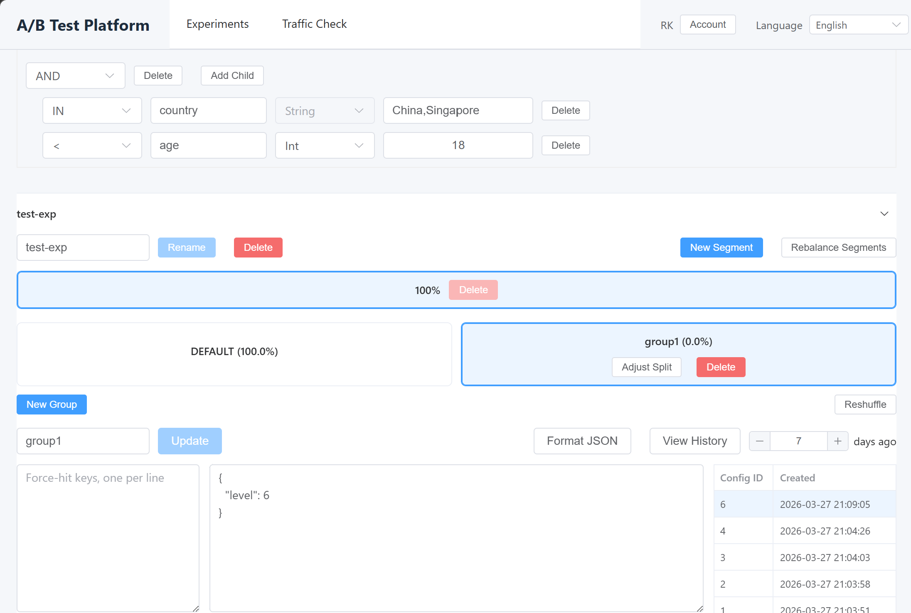
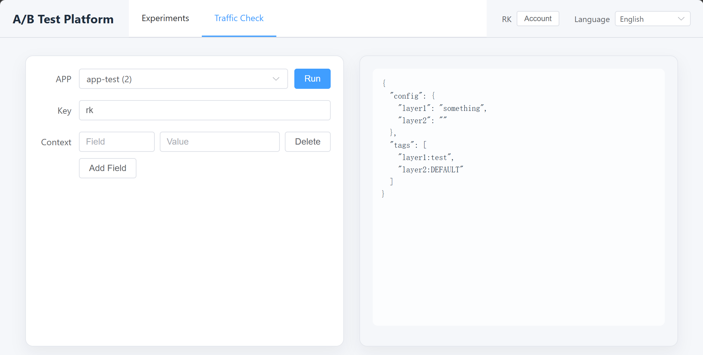

# simple-abtest

[中文](README.md)

`simple-abtest` is a self-hosted A/B testing platform for centralized experiment management, online traffic allocation, and local SDK-based evaluation. It is designed for teams that want full control over experiment configuration, request flows, and data assets.

## Highlights

- Experiment management: organize experiments by application, with support for creating, editing, enabling, disabling, and deleting experiments.
- Access control: supports multi-user login and per-application roles, including read-only, read-write, and administrator.
- Conditional targeting: define matching conditions based on business context so that only eligible requests enter an experiment.
- Online verification: enter a key and context to inspect the evaluation result for easier debugging.
- Forced targeting: route a specific key to a designated variant for testing and validation.
- Advanced experiment flow: supports two-stage traffic allocation, multi-layer traffic pass-through, traffic slot rotation between groups, and configuration rollback for long-running experiments.
- Flexible integration: use online APIs for real-time decisions or local SDKs to reduce request overhead.

## Admin Console
### List Page

### Detail Page

### Verification Page

### Notes
- The admin console currently does not enforce exclusivity checks for naming or forced targeting. If conflicts occur, behavior is undefined, so please avoid overlapping configurations.
- To mitigate traffic polarization in long-running experiments, when traffic is adjusted for a non-default group, its traffic slots are rotated with the default group while keeping the current traffic ratio unchanged. Because of this behavior, the default group is not always suitable as the control group, and a separate control group may be preferable.
- Data visualization is not implemented yet. Use the generated traffic tags in your existing analytics or visualization platform.

## Service Components

```
User -> Admin - UI
          \
Client ->- -> Engine
```

- `admin`: admin console.
- `engine`: traffic allocation service.
- `sdk-go`, `sdk-java`, `sdk-cpp`: SDKs for local evaluation.

## Integration

### Online Allocation

Your application sends requests to `engine` and receives the matched configuration and tags. The verification page in the admin console uses the same path, so it has the same propagation delay.

```http
POST /
ACCESS_TOKEN: <app-access-token>
Content-Type: application/json
```

```json
{
  "appid": 1001,
  "key": "user-123",
  "context": {
    "country": "CN",
    "platform": "ios"
  }
}
```

Example response:

```json
{
  "config": {
    "feed_rank": "{\"version\":\"B\"}",
    "card_style": "{\"style\":\"large\"}"
  },
  "tags": [
    "feed_rank:variant_b",
    "card_style:control"
  ]
}
```

### Local SDK

The SDK periodically pulls experiment snapshots and performs evaluation inside your application process, which makes it suitable for high-frequency scenarios.

Go example:

```go
package main

import (
	"fmt"
	"time"

	sdk "github.com/peterrk/simple-abtest/sdk-go"
)

func main() {
	client, err := sdk.NewClient("http://127.0.0.1:8080", 1001, "your-token", 5*time.Minute)
	if err != nil {
		panic(err)
	}
	defer client.Close()

	cfg, tags := client.AB("user-123", map[string]string{
		"country":  "CN",
		"platform": "ios",
	})
	fmt.Println(cfg)
	fmt.Println(tags)
}
```

Other SDK documentation:

- [sdk-java/README.md](sdk-java/README.md)
- [sdk-cpp/README.md](sdk-cpp/README.md)

## Quick Start

Recommended dependencies:

- Go `1.26+`
- Node.js `22+`
- MySQL `8+`
- Redis `6+`

Initialize the database:

```bash
mysql -uroot -p abtest < db/admin.sql
mysql -uroot -p abtest < db/engine.sql
```

Example configuration:

`admin/config.yaml`

```yaml
db: "abtest:abtest@tcp(127.0.0.1:3306)/abtest?parseTime=true&charset=utf8mb4"
redis:
  address: "127.0.0.1:6379"
  password: ""
  pool_size: 10
  idle_size: 2
redis_prefix: "sab-"
test: false
```

Notes:

- `db`: MySQL connection string used by both `admin` and `engine`.
- `redis.address`: Redis address used by the admin console for session storage and permission caching.
- `redis_prefix`: set an isolated prefix for the current environment to avoid collisions with other environments.
- `test`: when set to `true`, more detailed debugging features are enabled. This is not recommended in production.

`engine/config.yaml`

```yaml
db: "abtest:abtest@tcp(127.0.0.1:3306)/abtest?parseTime=true&charset=utf8mb4"
interval_s: 300
```

Notes:

- `interval_s`: how often the engine pulls the latest experiment snapshot from the database. The recommended default is `300` seconds.

Build artifacts:

```bash
./build.sh
```

The script checks whether Go and Node.js/npm build environments are available on the local machine, then builds:

- `bin/admin`
- `bin/engine`
- `ui/dist`

When starting the services, it is recommended to run the built binaries directly:

```bash
./bin/admin -config admin/config.yaml -port 8001 -ui-resource ./ui/dist -engine http://127.0.0.1:8080
./bin/engine -config engine/config.yaml -port 8080
```
