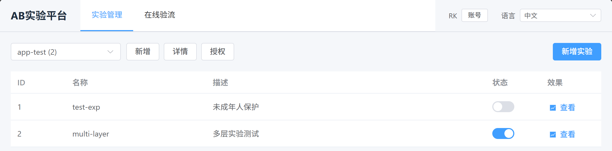
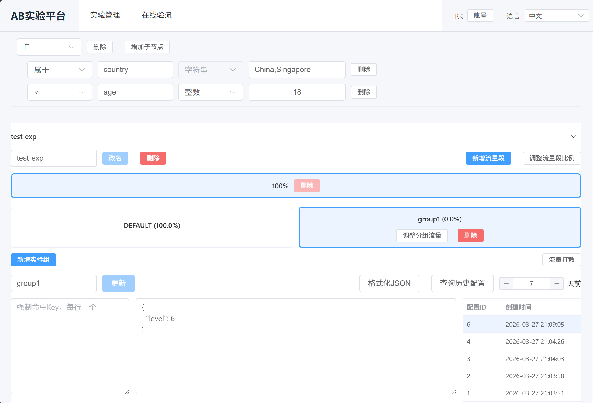
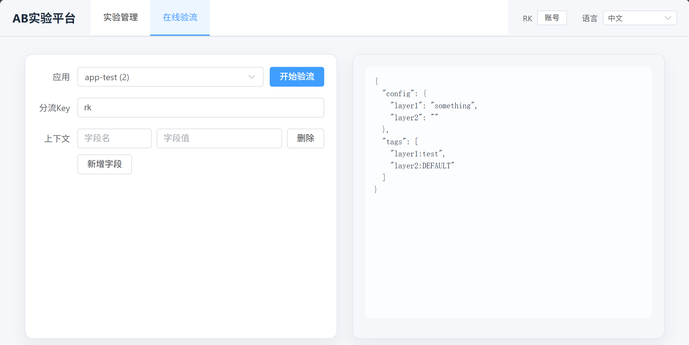

# simple-abtest

[中文](README.md) | [English](README-EN.md) | [Español](README-ES.md) | [Français](README-FR.md) | [日本語](README-JA.md) | [Deutsch](README-DE.md)

`simple-abtest`は、自前運用できるA/B実験プラットフォームです。実験管理、判定確認、SDKによるローカル判定をまとめて提供し、設定、配信経路、データ連携を自チームで制御したい場面に向いています。

## できること

- アプリ単位の実験管理: 1 つのアプリ配下で複数の実験を管理し、作成、編集、有効化、停止、削除を行えます。
- アプリ単位の権限制御: 複数利用者に対して、閲覧、編集、管理者の権限を付与できます。
- 条件による対象絞り込み: 実験のフィルター条件に一致したリクエストだけを実験対象にできます。
- 判定確認: `key`と`context`を入力すると、実際に返る設定とタグを管理画面から確認できます。
- 強制命中: 特定の `key` を指定グループへ固定できるため、受け入れ確認や再現検証に便利です。
- マルチレイヤー実験: 1 つの実験に複数の `layer` を持たせ、設定出力を軸ごとに分けて返せます。
- レイヤー間の流量整列: `segment` はレイヤー横断で共有される流量区間を表し、単なるバリアント名ではありません。
- 区間内の配分管理: 実際の命中先は `group` で決まり、各 group が配分、設定、設定履歴を持ちます。
- 2つの接続方法: `engine`によるオンライン判定と、SDKがスナップショットを取得して行うローカル判定の両方に対応します。

## 管理画面
### 一覧ページ

### 詳細ページ

### 判定確認ページ

### 利用上の注意
- 現時点では、命名や `force_hit` の重複に対する排他検査はありません。設定が衝突すると挙動が不安定になるため、重複は避けてください。
- 長期実験で偏りを抑えるため、非デフォルトグループの配分を調整すると、デフォルトグループとの間で一部 bucket を入れ替えます。このとき即時の比率は維持されるため、デフォルトグループが必ずしも対照群に向くとは限りません。
- 判定確認は分流サービスを直接呼び出すため、管理画面での変更が反映されるまで少し遅延があります。
- 可視化機能はまだ含まれていません。`engine` が返すタグを既存の分析基盤や可観測基盤に連携して使う想定です。

## サービス構成

```
User -> Admin - UI
          \
Client ->- -> Engine
```

- `admin`: 管理画面と運用 API。
- `engine`: 判定と流量配分を担うサービス。
- `sdk-go`, `sdk-java`, `sdk-cpp`: ローカル判定用 SDK。

## 接続方法

### オンライン判定

業務アプリケーションは`engine`にリクエストを送り、命中した設定とタグを受け取ります。管理画面の判定確認ページも同じ経路を使うため、同じ反映遅延があります。

```http
POST /
ACCESS_TOKEN: <app-access-token>
Content-Type: application/json
```

```json
{
  "appid": 1001,
  "key": "user-123",
  "context": {
    "country": "CN",
    "platform": "ios"
  }
}
```

応答例:

```json
{
  "config": {
    "feed_rank": "{\"version\":\"B\"}",
    "card_style": "{\"style\":\"large\"}"
  },
  "tags": [
    "feed_rank:variant_b",
    "card_style:control"
  ]
}
```

### ローカルSDK

SDKは定期的に実験スナップショットを取得し、業務プロセス内で判定を実行します。高頻度に判定が走る経路や、ネットワーク依存を減らしたい構成に向いています。

Go 例:

```go
package main

import (
	"fmt"
	"time"

	sdk "github.com/peterrk/simple-abtest/sdk-go"
)

func main() {
	client, err := sdk.NewClient("http://127.0.0.1:8080", 1001, "your-token", 5*time.Minute)
	if err != nil {
		panic(err)
	}
	defer client.Close()

	cfg, tags := client.AB("user-123", map[string]string{
		"country":  "CN",
		"platform": "ios",
	})
	fmt.Println(cfg)
	fmt.Println(tags)
}
```

他の SDK:

- [sdk-java/README.md](sdk-java/README.md)
- [sdk-cpp/README.md](sdk-cpp/README.md)

## クイックスタート

推奨依存環境:

- Go `1.26+`
- Node.js `22+`
- MySQL `8+`
- Redis `6+`

データベース初期化:

```bash
mysql -uroot -p abtest < db/admin.sql
mysql -uroot -p abtest < db/engine.sql
```

設定例:

`admin/config.yaml`

```yaml
db: "abtest:abtest@tcp(127.0.0.1:3306)/abtest?parseTime=true&charset=utf8mb4"
redis:
  address: "127.0.0.1:6379"
  password: ""
  pool_size: 10
  idle_size: 2
redis_prefix: "sab-"
test: false
```

補足:

- `db`: `admin` と `engine` が共用する MySQL 接続文字列です。
- `redis.address`: 管理画面でセッションと権限キャッシュに使う Redis の接続先です。
- `redis_prefix`: 環境ごとに異なる prefix を付けると、他環境との衝突を避けられます。
- `test`: `true` にすると追加のデバッグ機能が有効になります。本番では非推奨です。

`engine/config.yaml`

```yaml
db: "abtest:abtest@tcp(127.0.0.1:3306)/abtest?parseTime=true&charset=utf8mb4"
interval_s: 300
```

補足:

- `interval_s`: `engine` が MySQL から最新の実験スナップショットを再読込する周期です。推奨既定値は `300` 秒です。

ビルド成果物:

```bash
./build.sh
```

このスクリプトは Go と Node.js/npm のビルド環境を確認したうえで、次を生成します:

- `bin/admin`
- `bin/engine`
- `ui/dist`

サービス起動時は、ビルド済みバイナリをそのまま利用する構成を推奨します:

```bash
./bin/admin -config admin/config.yaml -port 8001 -ui-resource ./ui/dist -engine http://127.0.0.1:8080
./bin/engine -config engine/config.yaml -port 8080
```
