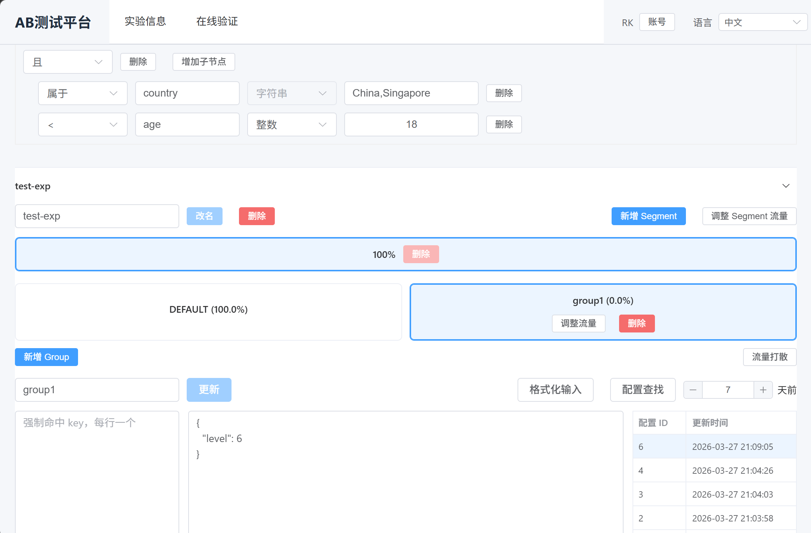

# simple-abtest

`simple-abtest` 是一套可自部署的A/B实验平台，帮助团队统一管理实验、在线分流并支持本地 SDK 判定。适合希望自己掌控实验配置、访问链路和数据资产的团队。



## 功能亮点

- 实验管理：按应用维护实验，支持创建、编辑、启停和删除。
- 权限管理：支持多用户登录，并按应用分配只读、读写、管理员权限。
- 条件过滤：可按业务上下文设置命中条件，只让符合条件的请求进入实验。
- 在线校验：可直接输入key和context查看命中结果，方便调试。
- 强制命中：支持按key定向命中指定实验组，用于测试验证。
- 复杂实验：双重分流，支持多层贯穿流量；支持组流量轮转和配置回溯（方便长期实验）。
- 多种接入：既可通过在线接口实时决策，也可通过本地SDK降低请求开销。

## 服务组成

```
User -> Admin - UI
          \
Client ->- -> Engine
```

- `admin`：管理后台与管理 API，同时对外提供 UI 和在线校验入口。
- `engine`：在线分流服务。
- `sdk-go`、`sdk-java`、`sdk-cpp`：本地判定 SDK。

## 使用方式

### 在线分流

业务服务向 `engine` 发送请求，获取命中的配置和标签。

```http
POST /
ACCESS_TOKEN: <app-access-token>
Content-Type: application/json
```

```json
{
  "appid": 1001,
  "key": "user-123",
  "context": {
    "country": "CN",
    "platform": "ios"
  }
}
```

返回示例：

```json
{
  "config": {
    "feed_rank": "{\"version\":\"B\"}",
    "card_style": "{\"style\":\"large\"}"
  },
  "tags": [
    "feed_rank:variant_b",
    "card_style:control"
  ]
}
```

### 本地 SDK

SDK 会定期拉取实验快照，在业务进程内完成判定，适合高频调用场景。

Go 示例：

```go
package main

import (
	"fmt"
	"time"

	sdk "github.com/peterrk/simple-abtest/sdk-go"
)

func main() {
	client, err := sdk.NewClient("http://127.0.0.1:8080", 1001, "your-token", 5*time.Minute)
	if err != nil {
		panic(err)
	}
	defer client.Close()

	cfg, tags := client.AB("user-123", map[string]string{
		"country":  "CN",
		"platform": "ios",
	})
	fmt.Println(cfg)
	fmt.Println(tags)
}
```

更多 SDK 说明：

- [sdk-java/README.md](sdk-java/README.md)
- [sdk-cpp/README.md](sdk-cpp/README.md)

## 快速部署

依赖环境：

- Go `1.26+`
- Node.js `22+`
- MySQL `8+`
- Redis `6+`

初始化数据库：

```bash
mysql -uroot -p abtest < db/admin.sql
mysql -uroot -p abtest < db/engine.sql
```

配置文件示例：

`admin/config.yaml`

```yaml
db: "abtest:abtest@tcp(127.0.0.1:3306)/abtest?parseTime=true&charset=utf8mb4"
redis:
  address: "127.0.0.1:6379"
  password: ""
  pool_size: 10
  idle_size: 2
redis_prefix: "sab-"
test: false
```

说明：

- `db`：MySQL 连接串，`admin` 和 `engine` 都会使用。
- `redis.address`：Redis 地址，管理端用于会话和权限缓存。
- `redis_prefix`：建议为当前环境设置独立前缀，避免和其他环境混用。
- `test`：设为 `true` 时会打开更详细的调试能力，不建议生产环境开启。

`engine/config.yaml`

```yaml
db: "abtest:abtest@tcp(127.0.0.1:3306)/abtest?parseTime=true&charset=utf8mb4"
interval_s: 300
```

说明：

- `interval_s`：引擎从数据库拉取最新实验快照的周期，默认建议保留为 `300` 秒。

构建产物：

```bash
./build.sh
```

脚本会检查本机是否具备 Go 和 Node.js/npm 构建环境，然后构建：

- `bin/admin`
- `bin/engine`
- `ui/dist`

启动服务时建议直接使用构建后的二进制：

```bash
./bin/admin -config admin/config.yaml -port 8001 -ui-resource ./ui/dist -engine http://127.0.0.1:8080
./bin/engine -config engine/config.yaml -port 8080
```
