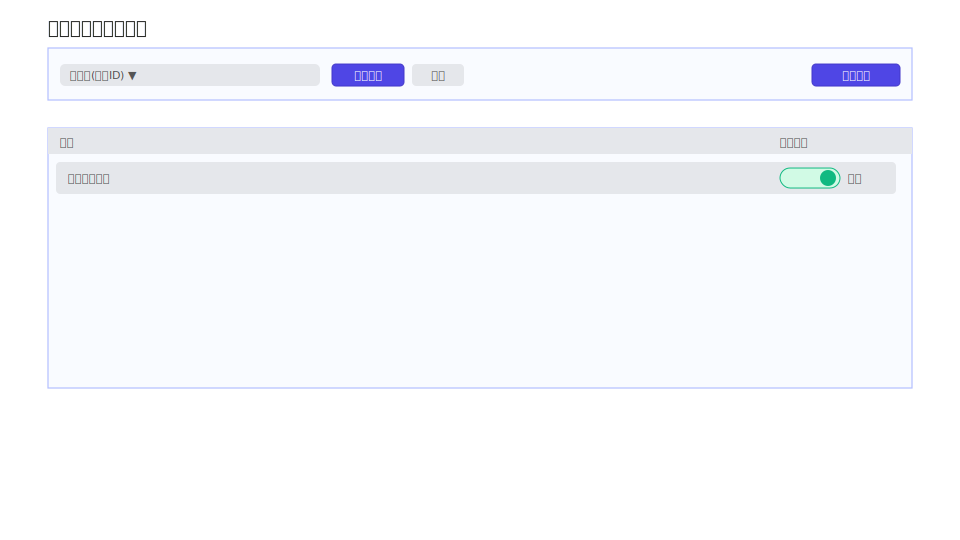
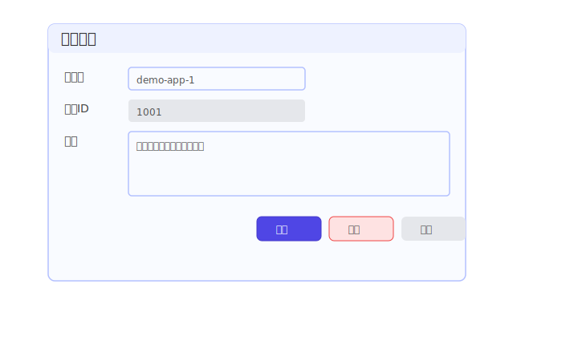
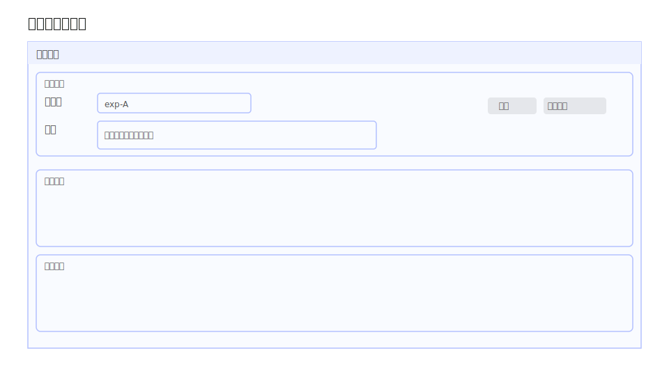
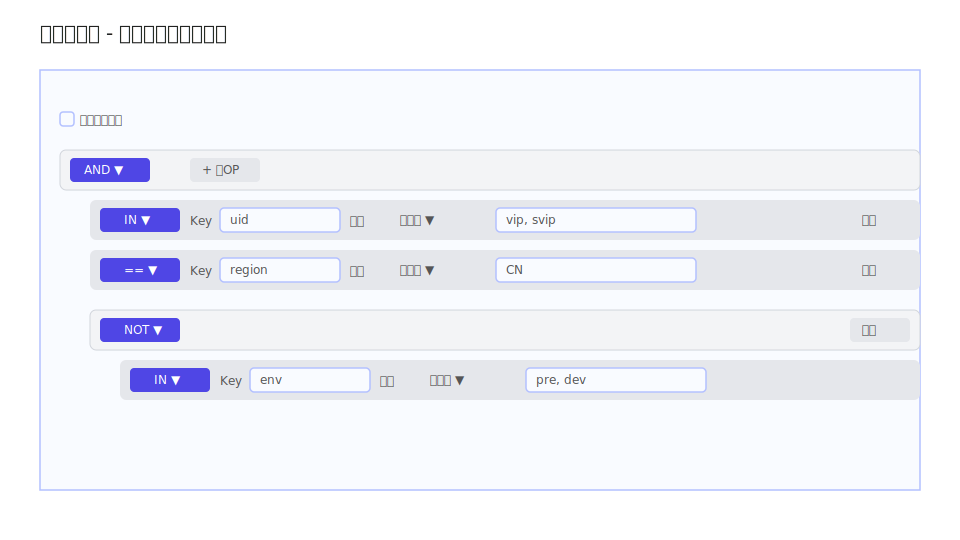
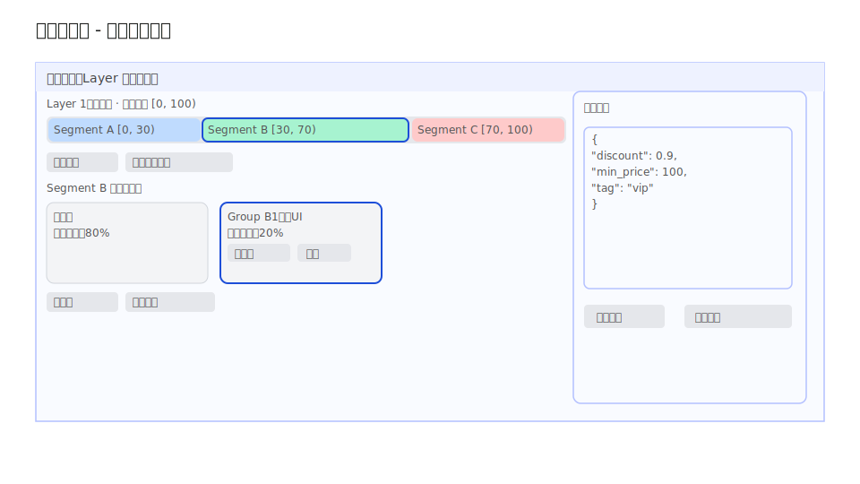
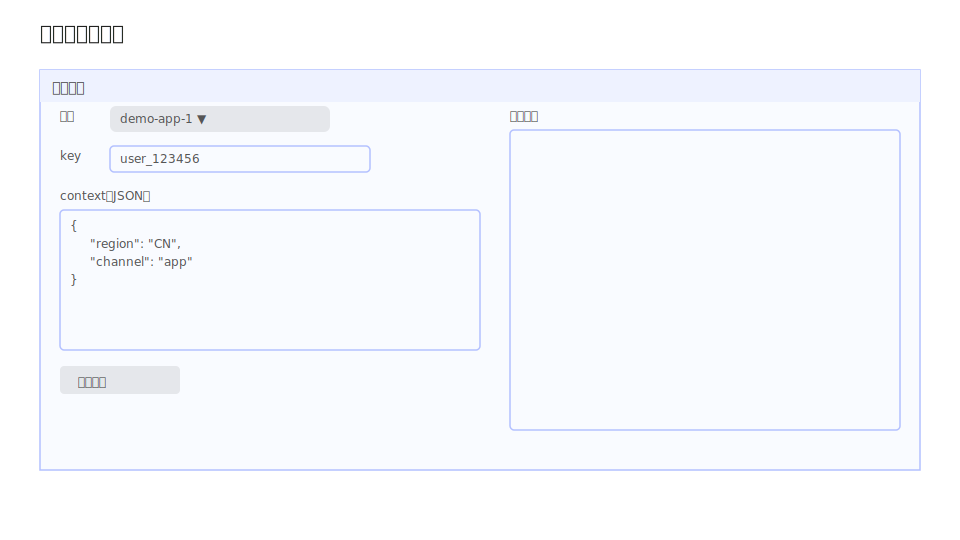

## AB 实验平台 Web UI 设计

本文档基于 `doc/data-model.md` 描述的数据模型，以及 `admin` / `engine` 服务的 HTTP API
（参考 `doc/admin-api.md`、`doc/engine-api.md`），定义三大核心页面与交互流程，仅包含
Markdown 形式的设计说明，不涉及实现代码。

---

## 1. 页面划分与整体结构

仅保留三大功能页面：

1. 实验列表页（应用选择作为下拉）
2. 实验详情页（Layer / Segment / Group / Config 动态展开）
3. 在线验证页（调用 engine）

说明：

- 实验列表页以 `application` 为入口，通过下拉切换当前应用，管理该应用下的实验。
- 实验详情页以单个 `experiment` 为核心，按需展开 `exp_layer` / `exp_segment` / `exp_group` / `exp_config`。
- 在线验证页调用 engine 服务进行命中验证与调试。

示意图预览：

- 实验列表页布局示意：`doc/images/exp-list.svg`
- 实验详情页示意：`doc/images/exp-detail.svg`
- 实验详情页过滤条件规则树示意：`doc/images/exp-detail-filter.svg`
- 实验详情页分流设置示意：`doc/images/exp-detail-traffic.svg`
- 在线验证页示意：`doc/images/online-verify.svg`

---

## 2. 页面设计：内容要点与交互 / API 关系

### 2.1 实验列表页（应用选择下拉）

**页面功能**

- 作为主入口，选择应用并管理该应用下的实验。
- 应用管理能力以页面内弹窗完成，不单独拆分页面。

**主要展示内容**

- 顶部工具条：
  - 左侧：应用下拉（显示“应用名(应用ID)”）、新增应用按钮、应用详情按钮（弹窗内支持编辑与删除）
  - 右侧：新增实验按钮
- 实验列表：
  - 列：`Name`、`生效状态`
  - 生效状态为滑动开关
  - 单行可点击，点击整行进入实验详情页

**效果示意图**

**相关后端 API**

- 应用列表与管理：
  - `GET /api/app`
  - `POST /api/app`
  - `PUT /api/app/:id`
  - `DELETE /api/app/:id`
- 应用下实验列表：
  - `GET /api/app/:id`
- 实验管理：
  - `POST /api/exp`
  - `PUT /api/exp/:id`
  - `DELETE /api/exp/:id`
  - `PUT /api/exp/:id/switch`
  - `POST /api/exp/:id/shuffle`

**关键交互与 API 映射**

1. 页面初始化
   - `GET /api/app` 加载应用下拉
   - 若存在默认选中应用，调用 `GET /api/app/:id` 获取实验列表

2. 切换应用
   - 选择下拉项后调用 `GET /api/app/:id` 刷新实验列表（version 仅在内部状态中更新）

3. 应用管理
   - 新建（主页面）：`POST /api/app`，body：`{ name, description }`
   - 详情弹窗：
     - 编辑：`PUT /api/app/:id`，body：`{ name, description, version }`
     - 删除：`DELETE /api/app/:id`，body：`{ version }`
   - 409 冲突：提示并重新 `GET /api/app/:id` 刷新

4. 创建实验
   - `POST /api/exp`，body：`{ app_id, app_ver, name, description, filter }`
   - 成功后重新 `GET /api/app/:id`

5. 切换生效状态（列表滑动开关）
   - `PUT /api/exp/:id/switch`（携带 `status`、`version`）
   - 409 冲突：提示后刷新 `GET /api/app/:id`
6. 其他操作在实验详情页完成
   - 编辑、删除、重置种子在实验详情页内操作

---

### 2.2 实验详情页（动态展开）

**页面功能**

- 展示单个实验完整结构，包含两个核心区域：
  1. 过滤条件树状规则引擎设置（映射到 `[]core.ExprNode`）
  2. 分流设置（Layer / Segment / Group / Config 的分流配置）
- 整体示意图中“过滤条件”和“分流设置”区块为留白占位，细节见对应子示意图。

**主要展示内容**

- 顶部实验信息卡片：
  - 主要信息：实验名、描述
  - 操作按钮：更新、流量打散（对应 `POST /api/exp/:id/shuffle`）

- 区域一：过滤条件（树状规则引擎）
  - 顶部通过一个“启用过滤条件”的勾选框控制是否生效：
    - 勾选：根据规则树对请求进行过滤。
    - 未勾选：视为 `filter` 为空，对所有请求不过滤。
  - 规则树主体（类目录树样式，无连线）：
    - 每一行代表一个节点，缩进表示层级。
    - 行内从左到右的控件：
      1. 逻辑/比较算子下拉框（Op，下拉选项映射 `OpType`）
      2. Key 输入框（字符串）
      3. 数据类型下拉（字符串 / 整数 / 浮点）
      4. 参数输入区
      5. 删除按钮
    - 父节点提供“+ 子OP”按钮，用于添加子规则。

- 区域二：分流设置
  - Layer 以纵向展开方式直接展示分流矩阵（无独立左侧层列表）。
  - 顶部 Segment 条（水平）
    - 横向一条 0–100% 的进度条，被划分为多个区块，每个区块对应一个 Segment。
    - 每个 Segment 区块内容显示 `[begin, end)` 的数值区间，如 `[0, 30)`。
    - Segment 操作按钮：新增分段、调整分段流量。
  - Segment 展开后的 Group 行（水平）
    - 默认组无操作按钮。
    - 非默认组提供：扩缩容、删除。
    - Group 区域操作按钮：新增组、流量打散（对应 `POST /api/exp/:id/shuffle`）。
  - 右侧配置区域：
    - 配置编辑框
    - 更新配置按钮
    - 历史配置按钮

**相关后端 API**

- 实验：
  - `GET /api/exp/:id`
  - `PUT /api/exp/:id`
  - `DELETE /api/exp/:id`
  - `PUT /api/exp/:id/switch`
  - `POST /api/exp/:id/shuffle`
- Layer：
  - `POST /api/lyr`
  - `GET /api/lyr/:id`
  - `PUT /api/lyr/:id`
  - `DELETE /api/lyr/:id`
  - `POST /api/lyr/:id/rebalance`
- Segment：
  - `POST /api/seg`
  - `DELETE /api/seg/:id`
  - `GET /api/seg/:id`
  - `POST /api/seg/:id/rebalance`
- Group：
  - `POST /api/grp`
  - `GET /api/grp/:id`
  - `PUT /api/grp/:id`
  - `DELETE /api/grp/:id`
- Config：
  - `GET /api/grp/:id/cfg`
  - `POST /api/grp/:id/cfg`

**关键交互与 API 映射**

1. 进入实验详情页
   - `GET /api/exp/:id` 获取实验基础信息（含 filter 配置与 layer 概览）。

2. 过滤条件编辑
   - 解析 `filter` JSON 为规则树并渲染。
   - 用户在规则树编辑器中增删改节点：
     - 前端在本地维护树结构与推断 dtype。
   - 规则树保存操作示意图未展示，保存时调用：
     - `PUT /api/exp/:id` 更新 experiment 的 filter 字段（内部携带 version）。

3. Layer 分流设置
   - 选择或展开某个 Layer 时：
     - 调用 `GET /api/lyr/:id` 获取 segments 信息。
   - 新建 Segment：
     - `POST /api/seg`（`lyr_id`、`lyr_ver`）。
   - 调整分段流量：
     - 点击“调整分段流量”时调用：
       - `POST /api/lyr/:id/rebalance`，body：`{ version, segment: [{id, begin, end}, ...] }`。

4. Segment 分流与 Group 管理
   - 展开某个 Segment 时：
     - `GET /api/seg/:id` 获取该 Segment 包含的 groups 及当前 share 信息。
   - Group 操作：
     - 新建 Group：`POST /api/grp`（`seg_id`、`seg_ver`）。
     - 删除 Group：`DELETE /api/grp/:id`（`seg_id`、`seg_ver`、`version`）。
   - 组流量扩缩容：
     - `POST /api/seg/:id/rebalance`，body：`{ version, grp_id, share }`。

5. Config 历史与绑定
   - 右侧配置区域点击“历史配置”：
     - 调用：`GET /api/grp/:id/cfg?begin=...`。
   - 点击“更新配置”：
     - `POST /api/grp/:id/cfg` 创建新配置。

6. 动态展开加载策略
   - 初次只加载 experiment 信息与 layer 概览。
   - “过滤条件区域”加载后，规则树完全在前端编辑，不必频繁请求。
   - “分流设置区域”按需展开：
     - 展开某 layer 时加载对应 segments。
     - 展开某 segment 时加载对应 groups。
   - 更新后仅刷新当前节点及其父节点的内部状态，不在界面上展示 version。

**效果示意图**

- 整体布局示意：

  

- 过滤条件区域示意：

  

- 分流设置区域示意：

  

---

### 2.3 在线验证页（engine）

**页面功能**

- 调用 engine 服务进行在线验证与调试
- 展示命中配置与分层标签

**主要展示内容**

- 表单：
  - 应用下拉（来源 `GET /api/app`）
  - key 输入框（必填）
  - context JSON 编辑器（可选）
- 结果：
  - 返回结果直接展示格式化后的 JSON（包含 `config` 与 `tags`）

**效果示意图**

**相关后端 API**

- `GET /api/app`
- `POST /`（engine）

**关键交互与异常处理**

- key 为空或 context 非法 JSON：前端拦截并提示
- 400：提示“参数错误，请检查 key/context 格式”
- 500：提示“engine 服务异常，请稍后再试或联系运维”

---

## 3. 用户交互流程与反馈

### 3.1 典型配置流程（仅三页）

1. 在实验列表页选择应用并创建实验
2. 进入实验详情页逐级展开配置：
   - Layer → Segment → Group → Config
   - 完成区间与流量 rebalance
3. 回到实验列表页启用实验
4. 在线验证页输入 key/context 验证命中结果

### 3.2 409 乐观锁冲突处理

- 所有写操作返回 409：
  - 提示“数据已被修改，已刷新最新版本”
  - 重新调用对应 `GET` 刷新当前节点
  - 更新本地 version 后允许再次提交

### 3.3 异常处理规范

- 400：定位到字段级错误并提示
- 404：提示资源不存在并收起当前节点，刷新上级列表
- 500：全局提示“操作失败，请稍后重试或联系管理员”

### 3.4 成功反馈

- 写操作成功统一 toast：
  - “保存成功 / 创建成功 / 删除成功 / 流量调整成功 / 状态切换成功”
- 影响线上流量的操作提示：
  - “变更会影响线上分流，请确认已完成验证”

---

本设计文档在三页面结构下保持功能完整，覆盖全部数据模型实体与 admin/engine API 的配置与验证能力。 
